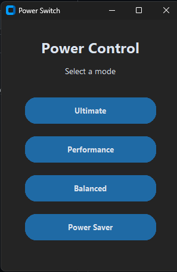

PowerPlanSwitcher

A lightweight, modern Windows Power Plan switcher. Toggle between your power plans instantly with a clean, dark-mode interface. No installation required—just run and switch.
📸 Preview

🚀 How to Use

    Go to the Releases section of this repository.

    Download the latest PowerPlanSwitcher.exe.

    Double-click the file to launch the app.

    Click any of the buttons to switch your Windows power plan.

Note: You may need to run the application as Administrator for the power plan commands to take effect on your system.
🛠 Features

    Modern UI: Sleek, dark-mode design.

    One-Click Switching: Quickly toggle "Ultimate", "Performance", "Balanced", or "Power Saver".

    Portable: No installer or Python installation required.

⚠️ Troubleshooting

    "Windows protected your PC": If you see a SmartScreen popup, click "More info" and then "Run anyway." This happens with small, self-compiled Python apps.

    "Ultimate" mode missing: If the Ultimate button doesn't work, your Windows version might not have that plan enabled. Run this command in CMD (Admin) to enable it:
    powercfg -duplicatescheme e9a42b02-d5df-448d-aa00-03f14749eb61

⚖️ License

This project is open-source and available under the MIT License.
